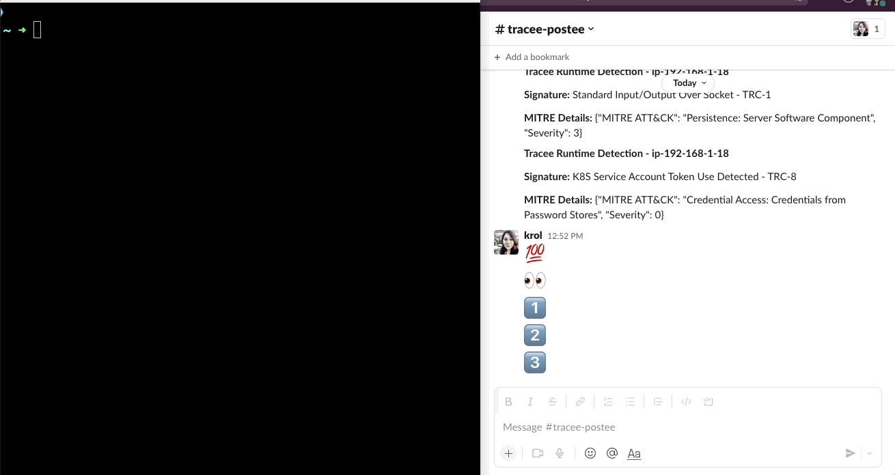

# Fileless demo

## Content

- [Fileless Linux with memfd](#fileless-linux-with-memfd_create)
- [Using Tracee](#demo-using-tracee-and-postee)
- [Using Falco](falco.md)
- [Using Tetragon](tetragon.md)


## Fileless Linux with memfd_create

- https://blog.aquasec.com/intro-to-fileless-malware-in-containers
- https://www.guitmz.com/running-elf-from-memory/
- https://blog.aquasec.com/fileless-malware-container-security
- https://dvdhrm.wordpress.com/2014/06/10/memfd_create2/
- https://blog.tofile.dev/2022/01/04/sysmonlinux.html
- https://djalal.opendz.org/post/ebpf-block-linux-fileless-payload-execution-with-bpf-lsm/

## Demo using Tracee and Postee

Receive a notification if you find suspicious behaviour in your cluster, at the runtime stage.



Install Tracee and Postee in Kubernetes [here](https://aquasecurity.github.io/tracee/v0.8.0/installing/kubernetes/)

---

## Image Scanning

```
trivy image --severity HIGH,CRITICAL --security-checks vuln,secret,config krol/demo-memrun
```

## Linux Events

```
strace -c ls
```

```
strace -c docker run hello-world
```

## Run the container

### Using docker

```
docker run --name demo01 krol/demo-memfd:v1
```

<details>
<summary>Show results</summary>

```
docker run --name demo01 krol/demo-memfd:v1
/docker-entrypoint.sh: /docker-entrypoint.d/ is not empty, will attempt to perform configuration
/docker-entrypoint.sh: Looking for shell scripts in /docker-entrypoint.d/
/docker-entrypoint.sh: Launching /docker-entrypoint.d/10-listen-on-ipv6-by-default.sh
10-listen-on-ipv6-by-default.sh: info: Getting the checksum of /etc/nginx/conf.d/default.conf
10-listen-on-ipv6-by-default.sh: info: Enabled listen on IPv6 in /etc/nginx/conf.d/default.conf
/docker-entrypoint.sh: Launching /docker-entrypoint.d/20-envsubst-on-templates.sh
/docker-entrypoint.sh: Launching /docker-entrypoint.d/30-tune-worker-processes.sh
/docker-entrypoint.sh: Configuration complete; ready for start up
2022/10/13 00:25:19 [notice] 1#1: using the "epoll" event method
2022/10/13 00:25:19 [notice] 1#1: nginx/1.21.6
2022/10/13 00:25:19 [notice] 1#1: built by gcc 10.2.1 20210110 (Debian 10.2.1-6)
2022/10/13 00:25:19 [notice] 1#1: OS: Linux 5.15.0-1020-aws
2022/10/13 00:25:19 [notice] 1#1: getrlimit(RLIMIT_NOFILE): 1048576:1048576
2022/10/13 00:25:19 [notice] 1#1: start worker processes
2022/10/13 00:25:19 [notice] 1#1: start worker process 31
````
</details></br>


Executing the program in a memory file descriptor

```
docker exec -t demo01 /memrun nginx /bin/date
```

```
docker run -it --rm krol/demo-memfd:v1 /demo-memfd nginx /bin/date
```

<details>
<summary>Show results</summary>

```
docker run -it --rm krol/demo-memfd:v1 /demo-memfd nginx /bin/date
Usage: process_name elf_binary_path
---> Create the memory file descriptor:  4
---> Reading ELF file path:  /bin/date
---> Writing ELF file in the memory file descriptor:  4
---> execve, executes the program pointed to /proc/self/fd/4 using the currently running process: nginx
Thu Oct 13 00:25:28 UTC 2022
````
</details></br>

### Using Kubernetes

```
kubectl run nginx-fileless --image=krol/demo-memrun 

```

Calling the fileless program `kubectl exec -ti nginx-fileless -- /memrun nginx /bin/date`
```
kubectl exec -ti nginx-fileless -- /memrun nginx /bin/date
Sat Sep  3 16:15:26 UTC 2022
```

## Runtime Security
### [Tracee](https://github.com/aquasecurity/tracee)
```
docker run \
   --name tracee --rm -it \
   --pid=host --cgroupns=host --privileged \
   -v /etc/os-release:/etc/os-release-host:ro \
   -e LIBBPFGO_OSRELEASE_FILE=/etc/os-release-host \
   aquasec/tracee:0.8.0


```

[](https://github.com/aquasecurity/tracee)

## More ELFs

```
curl -o /tmp/elf-fileless https://raw.githubusercontent.com/DenizBasgoren/elf32-hello-world/master/a.out && ./memrun nginx /tmp/elf-fileless
```
