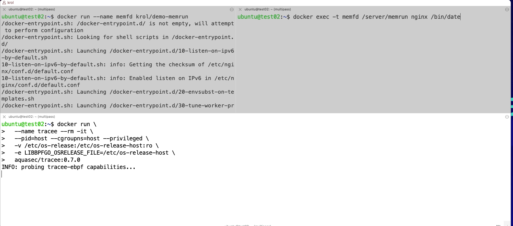

# Fileless demo

## Image Scanning

```
trivy image --severity HIGH,CRITICAL --security-checks vuln,secret,config krol/demo-memrun
```

## Linux Events

```
strace -c ls
```

```
strace -c docker run hello-world
```

## Run the container

```
docker run --name demo01 krol/demo-memrun
```
Called the fileless program

```
docker exec -t demo01 /memrun nginx /bin/date
```

```
docker run -it --rm krol/demo-memrun /memrun nginx /bin/date
```
## Runtime Security
### [Tracee](https://github.com/aquasecurity/tracee)
```
docker run \
   --name tracee --rm -it \
   --pid=host --cgroupns=host --privileged \
   -v /etc/os-release:/etc/os-release-host:ro \
   -e LIBBPFGO_OSRELEASE_FILE=/etc/os-release-host \
   aquasec/tracee:0.8.0


```

[](https://github.com/aquasecurity/tracee)

## More ELFs

```
curl -o /tmp/elf-fileless https://raw.githubusercontent.com/DenizBasgoren/elf32-hello-world/master/a.out && ./memrun nginx /tmp/elf-fileless
```
